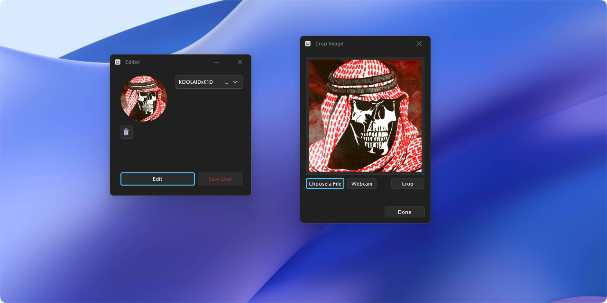

# Hotswap
### Remote avatar changer for the PS5. 



## Features
- Uses existing FTP solutions. No payload needed!
- Automatically handles .png/.dds file resizing and formatting
- Built-in crop tool and photo editor
- Pick image or take a picture with your webcam
- Pull and save existing avatar
- Automatic Light and Dark Mode themes

## How to Use
1) Input IP and Port to connect and grab the user data.
2) Make desired changes.
3) Click Save User to save changes to a given user.

## Build Instructions

- Install [Visual Studio 2022](https://visualstudio.microsoft.com/downloads) and install [.NET Framework 4.8 Developer Pack](https://dotnet.microsoft.com/en-us/download/dotnet-framework/thank-you/net48-developer-pack-offline-installer).
- Signup and get a free auth key at [Nuget.Devexpress.com](https://nuget.devexpress.com/)
- Open VS and open the solution. Go into View > Other Windows > Package Manager Console. Enter the following:

```
dotnet nuget add source https://nuget.devexpress.com/api -n DXFeed -u DevExpress -p {your auth key}
Install-Package DevExpress.Win
Unblock-File PS5-Profile-Modder/ConnectForm.resx
Unblock-File PS5-Profile-Modder/Editor.resx
```
- The other dependencies *should* sort themselves out automatically. 
- Click on Editor.cs in the solution explorer. This will trigger a license file to be created in the Properties folder. Once this happens, you can **delete the license.licx** file (if you don't delete it, you will have popups when you run the program.)
- Build (Ctrl-Shift-B)

---

thanks [@DizzRL](https://twitter.com/dizzrl)
